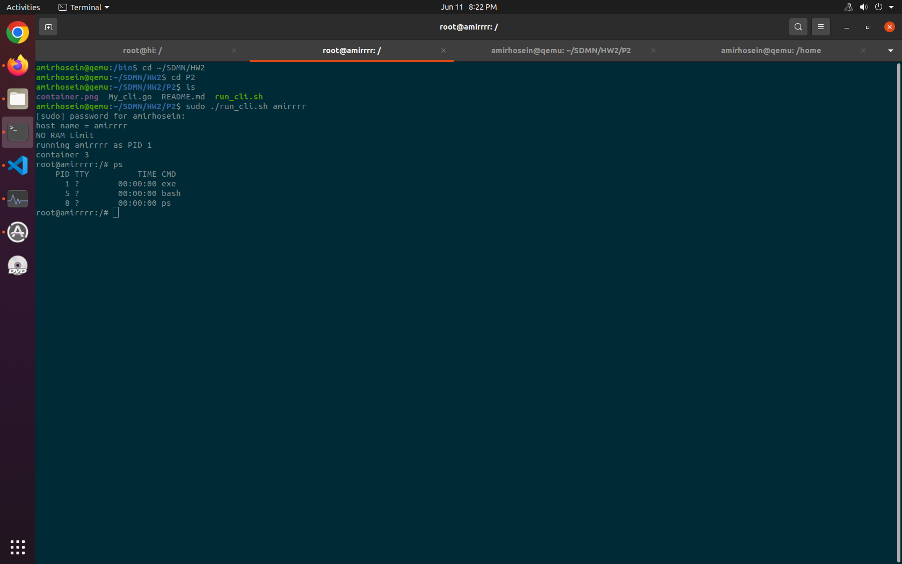

# Problem 2
## Container Runtime

For this problem I used Golang and for running the code you must have go installed.
```console
sudo apt install go
```

Also you need ubuntu root file system tarball in /home directory as rootfs.tar.gz.
```console
sudo cp -r rootfs.tar.gz /home/
```

Now you can run my cli simply with run_cli.sh bash that has two options:

1- hostname

2- [optional] RAM Limitation in MegaBytes

The bash script makes new directory for container and copies ubuntu rootfs in it for every new container, also at the end the directory will be deleted.
 
The bash runs My_cli.go file which makes a new container with the hostname and new pid/uts/mnt/net namespaces.

So you should run the command below to make such a container :
```console
sudo ./run_cli.sh myhostname [RAM(Optional)]
```


